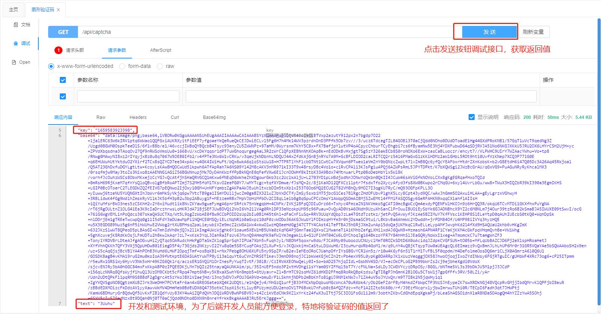
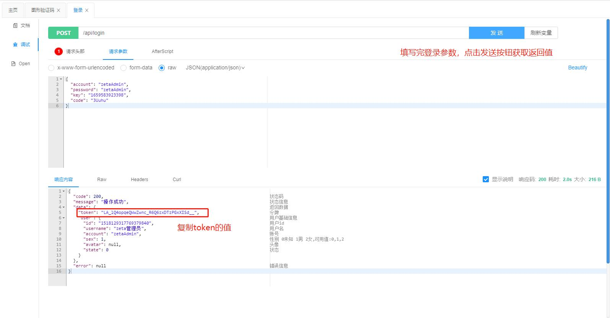
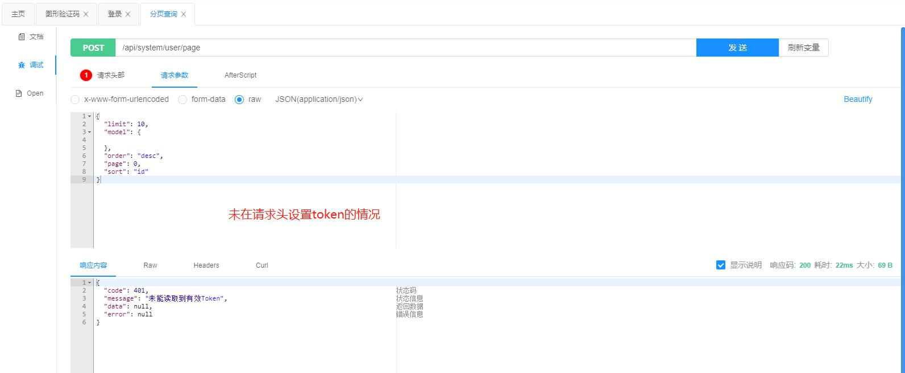
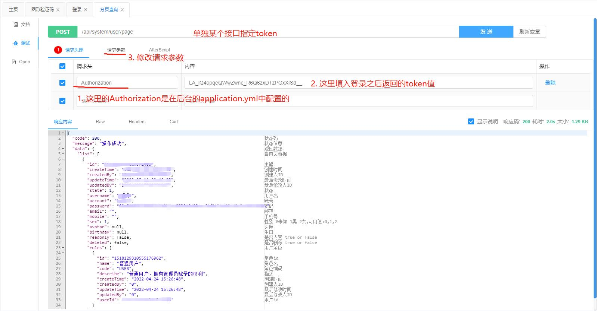
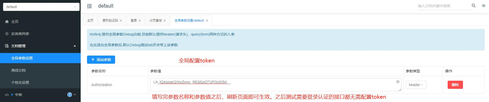

# Swagger配置
本项目使用knife4j对swagger的默认ui做了增强。

knife4j接口文档的访问地址是：http://ip:端口/doc.html

以下是配置文件的基本写法
```yaml
zeta:
  # swagger 文档通用配置
  swagger:
    # 描述
    description: 项目接口文档
    # 版本
    version: ${zeta.version}
    # swagger会解析的包路径
    basePackage: com.zeta
    # 服务URL
    termsOfServiceUrl: http://localhost:${server.port}
    contact:
      # 联系人
      name: gcc

# knife4j配置 https://doc.xiaominfo.com/knife4j/documentation/enhance.html
knife4j:
  # 是否开启Knife4j增强模式
  enable: true
  # 前端Ui的个性化配置属性
  setting:
    # Ui默认显示语言,目前主要有两种:中文(zh-CN)、英文(en-US)
    language: zh-CN
    # 是否在每个Debug调试栏后显示刷新变量按钮,默认不显示
    enableReloadCacheParameter: true
    # 是否开启界面中对某接口的版本控制,如果开启，后端变化后Ui界面会存在小蓝点
    enableVersion: true
    # 是否显示界面中SwaggerModel功能
    enableSwaggerModels: true
    # 是否显示界面中"文档管理"功能
    enableDocumentManage: true
    # 重命名SwaggerModel名称
    swaggerModelName: 实体类列表
    # 是否开启动态参数调试功能
    enableDynamicParameter: true
    # 是否显示footer
    enableFooter: false
```

更多详细配置，可以从`org.zetaframework.core.swagger.properties.SwaggerProperties`类获得

## knife4j文档的用法

可能有人没有接触过swagger或者没使用过knife4j的ui，特在此简单说明一下使用方法

1. 获取验证码


2. 登录


3. 测试调用需要登录才能访问的接口

未配置token的情况


单独指定某个接口的token


配置全局token

