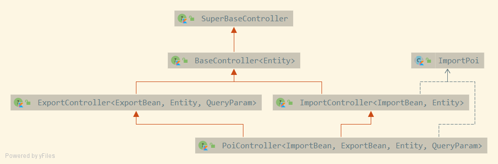

# Excel导入导出

前排声明：

zeta-kotlin项目的Excel导入导出设计参考自[lamp-boot](https://github.com/zuihou/lamp-boot) 项目，在lamp-boot项目的设计上进行了不少变更。

正文内容：

zeta-kotlin项目提供了`PoiController`接口方便快速实现Excel导入和导出功能


## 类关系图



如图所示，想要快速实现Excel导入和导出功能，需要额外创建`ImportBean`和`ExportBean`类

这两个类分别是`Excel导入数据对应类`和`Excel导出数据对应类`

## 如何使用

> 我想在用户管理里面添加导入用户、导出用户功能

最简单的集成方式。（不考虑参数校验，不关联用户角色等）

第一步：创建`ImportBean`类

```kotlin
/**
 * 用户Excel导入数据
 *
 * @author gcc
 */
class SysUserImportPoi: ImportPoi() {

    /** 用户名 */
    @Excel(name = "用户名", width = 15.0)
    var username: String? = null

    /** 账号 */
    @Excel(name = "账号", width = 15.0)
    var account: String? = null

    /** 密码 */
    @Excel(name = "密码", width = 50.0)
    var password: String? = null

    /** 邮箱 */
    @Excel(name = "邮箱", width = 15.0)
    var email: String? = null

    /** 手机号 */
    @Excel(name = "手机号", width = 15.0)
    var mobile: String? = null

    /** 性别 */
    @Excel(name = "性别", replace = ["男_1", "女_2", "_null"], addressList = true)
    var sex: Int? = null

    /** 生日 */
    @Excel(name = "生日", format = DatePattern.NORM_DATE_PATTERN, width = 20.0)
    var birthday: LocalDate? = null
}
```

第二步：创建`ExportBean`类

```kotlin
/**
 * 用户Excel导出数据
 *
 * @author gcc
 */
class SysUserExportPoi {

    /** id */
    @Excel(name = "id", width = 20.0)
    var id: Long? = null

    /** 用户名 */
    @Excel(name = "用户名", width = 15.0)
    var username: String? = null

    /** 账号 */
    @Excel(name = "账号", width = 15.0)
    var account: String? = null

    /** 密码 */
    @Excel(name = "密码", desensitizationRule="3_4", width = 50.0)
    var password: String? = null

    /** 邮箱 */
    @Excel(name = "邮箱", width = 15.0)
    var email: String? = null

    /** 手机号 */
    @Excel(name = "手机号", width = 15.0)
    var mobile: String? = null

    /** 性别 */
    @Excel(name = "性别", replace = ["男_1", "女_2", "_null"], addressList = true)
    var sex: Int? = null

    /** 生日 */
    @Excel(name = "生日", format = DatePattern.NORM_DATE_PATTERN, width = 20.0)
    var birthday: LocalDate? = null

    /** 状态 */
    @Excel(name = "状态", replace = ["正常_0", "封禁_1", "_null"])
    var state: Int? = null

    /** 注册时间 */
    @Excel(name = "注册时间", format = DatePattern.NORM_DATETIME_PATTERN, width = 20.0)
    var createTime: LocalDateTime? = null
}
```

第三步：手动处理导入的数据

```kotlin
// 省略无关注解
class SysUserController:
    SuperSimpleController<ISysUserService, SysUser>(),
    // 实现PoiController接口
    PoiController<SysUserImportPoi, SysUserExportPoi, SysUser, SysUserQueryParam>
{

    /**
     * 处理导入数据
     *
     * 说明：
     * 你需要手动实现导入逻辑
     */
    override fun handlerImport(list: MutableList<SysUserImportPoi>): ApiResult<Boolean> {
        // ImportBean -> SysUser
        val batchList: List<SysUser> = list.map { 
            BeanUtil.toBean(it, SysUser::class.java)
        }
        
        // 批量保存
        return success(service.saveBatch(batchList))
    }
}
```

由上述代码可知，仅仅需要创建导入、导出类，手动实现数据导入功能即可实现Excel导入、导出功能。

## 单独使用

> 有时候，仅仅需要导出功能怎么办？

基于以上情况，本人将`PoiController`拆分成了`ImportController`、`ExportController`和`PoiController`三个接口。

如果只想要有导出功能, 实现`ExportController`接口，重写`findExportList`方法即可

```kotlin
// 省略无关注解
class SysUserController:
    SuperSimpleController<ISysUserService, SysUser>(),
    // 实现ExportController接口
    ExportController<SysUserExportPoi, SysUser, SysUserQueryParam>
{

    /**
     * 获取待导出的数据 （对要导出的数据进行处理）
     *
     * @param param QueryParam
     * @return MutableList<Entity>
     */
    override fun findExportList(param: SysUserQueryParam): MutableList<SysUserExportPoi> {
        // 条件查询SysUser数据
        val entity = BeanUtil.toBean(param, SysUser::class.java)
        val list = getBaseService().list(QueryWrapper<SysUser>(entity))
        if (list.isNullOrEmpty()) return mutableListOf()

        // 批量获取用户角色 Map<用户id, 用户角色列表>
        val userIds: List<Long> = list.map { it.id!! }
        val userRoleMap: Map<Long, List<SysRoleDTO>> = service.getUserRoles(userIds)
        list.forEach { user ->
            user.roles = userRoleMap.getOrDefault(user.id, mutableListOf())
        }

        // 对要导出的数据进行处理  SysUser -> SysUserExportPoi
        return list.map { user ->
            val exportPoi = BeanUtil.toBean(user, SysUserExportPoi::class.java)
            // 处理用户角色 ps:导出角色名还是导出角色编码看需求
            exportPoi.roles = user.roles?.mapNotNull { it.name }
            exportPoi
        }.toMutableList()
    }
}
```

只想要导入接口，代码也同理。实现`ImportController`并重写对应的方法

## 高级功能

这样的导入、导出功能仅仅是对单表数据进行操作，如果业务稍微复杂一点，需要对导入、导出的数据进行一定的自定义处理呢？

又或者，需要对导入的数据进行非空校验，长度校验，重复校验等操作，可以吗？

`PoiController`的导入、导出方法具有灵活的可自定义性，可以较好的解决上述问题。请看下面的例子

> 我想要在导出用户数据的同时，导出用户拥有的角色

第一步：`ExportBean`类添加需要导出的字段

```kotlin
/**
 * 用户Excel导出数据
 *
 * @author gcc
 */
class SysUserExportPoi {

    // 省略其它字段

    /** 用户角色 */
    @Excel(name = "用户角色", width = 20.0)
    var roles: List<String>? = null
    
}
```

第二步：对要导出的数据进行处理

```kotlin
// 省略无关注解
class SysUserController:
    SuperSimpleController<ISysUserService, SysUser>(),
    // 实现PoiController接口
    PoiController<SysUserImportPoi, SysUserExportPoi, SysUser, SysUserQueryParam>
{

    /**
     * 获取待导出的数据 （对要导出的数据进行处理）
     *
     * @param param QueryParam
     * @return MutableList<Entity>
     */
    override fun findExportList(param: SysUserQueryParam): MutableList<SysUserExportPoi> {
        // 条件查询SysUser数据
        val entity = BeanUtil.toBean(param, SysUser::class.java)
        val list = getBaseService().list(QueryWrapper<Entity>(entity))
        if (list.isNullOrEmpty()) return mutableListOf()

        // 批量获取用户角色 Map<用户id, 用户角色列表>
        val userIds: List<Long> = list.map { it.id!! }
        val userRoleMap: Map<Long, List<SysRoleDTO>> = service.getUserRoles(userIds)
        list.forEach { user ->
            user.roles = userRoleMap.getOrDefault(user.id, mutableListOf())
        }

        // 对要导出的数据进行处理  SysUser -> SysUserExportPoi
        return list.map { user ->
            val exportPoi = BeanUtil.toBean(user, SysUserExportPoi::class.java)
            // 处理用户角色 ps:导出角色名还是导出角色编码看需求
            exportPoi.roles = user.roles?.mapNotNull { it.name }
            exportPoi
        }.toMutableList()
    }
}
```

> 我想在导入用户的时候，校验Excel用户账号密码是否为空、用户手机号长度是否超过11位

第一步: `ImportBean`类, 需要校验的字段加上validation提供的注解即可。

注意：和Spring boot参数校验不同的是，不需要写成`@get:NotBlank`、`@get:NotNull`这样的形式

```kotlin
/**
 * 用户Excel导入数据
 *
 * @author gcc
 */
class SysUserImportPoi: ImportPoi() {

    /** 用户名 */
    @Excel(name = "用户名", width = 15.0)
    @NotBlank(message = "不能为空")  // 加上校验注解
    var username: String? = null

    /** 账号 */
    @Excel(name = "账号", width = 15.0)
    @NotBlank(message = "不能为空")  // 加上校验注解
    var account: String? = null

    /** 密码 */
    @Excel(name = "密码", width = 50.0)
    @NotBlank(message = "不能为空")  // 加上校验注解
    var password: String? = null
    
    /** 手机号 */
    @Excel(name = "手机号", width = 15.0)
    @Size(max = 11, message = "长度不能超过11") // 加上校验注解
    var mobile: String? = null

    // 省略其它字段
}
```

第二步：开启校验上传的Excel数据校验功能

```kotlin
// 省略无关注解
class SysUserController:
    SuperSimpleController<ISysUserService, SysUser>(),
    // 实现PoiController接口
    PoiController<SysUserImportPoi, SysUserExportPoi, SysUser, SysUserQueryParam>
{

    /**
     * 导入参数增强
     *
     * 说明：
     * 你可以在这里对ImportParams配置进行一些补充
     * 例如设置excel验证规则、校验组、校验处理接口等
     */
    override fun enhanceImportParams(importParams: ImportParams) {
        // 开启：校验上传的Excel数据
        importParams.isNeedVerify = true
    }
   
}
```

> 账号不可重复，我想在导入用户的时候，提示哪一行数据的账号重复了。可以吗？

#### 简单的方案（实现一个匿名接口）

```kotlin
// 省略无关注解
class SysUserController:
    SuperSimpleController<ISysUserService, SysUser>(),
    // 实现PoiController接口
    PoiController<SysUserImportPoi, SysUserExportPoi, SysUser, SysUserQueryParam>
{

    /**
     * 导入参数增强
     *
     * 说明：
     * 你可以在这里对ImportParams配置进行一些补充
     * 例如设置excel验证规则、校验组、校验处理接口等
     */
    override fun enhanceImportParams(importParams: ImportParams) {
        importParams.isNeedVerify = true
        // 校验处理接口：用户名重复校验 （实现一个匿名接口）
        importParams.verifyHandler = object: IExcelVerifyHandler<SysUserImportPoi> {
            override fun verifyHandler(obj: SysUserImportPoi): ExcelVerifyHandlerResult {
                // 判断是否存在
                return if (ExistParam<SysUser, Long>(SysUser::account, obj.account).isExist(service)) {
                    ExcelVerifyHandlerResult(false, "账号已存在")
                } else ExcelVerifyHandlerResult(true, "")
            }
        }
    }

}
```

返回结果
```json
{
  "code": -1,
  "message": "第1行校验错误：账号已存在\n第2行校验错误：账号已存在",
  "data": null,
  "error": null
}
```

#### 稍微复杂一点的方案(自定义`ExcelVerifyHandler`类)

第一步：创建一个自定义的`ExcelVerifyHandler`类 说明：这些操作[easypoi文档](http://doc.wupaas.com/docs/easypoi) 都有写

```kotlin
/**
 * 用户Excel导入校验接口实现类
 *
 * @author gcc
 */
@Component
class SysUserExcelVerifyHandler(private val service: ISysUserService): IExcelVerifyHandler<SysUserImportPoi> {

    /**
     * 导入校验方法
     *
     * @param obj 导入对象
     * @return
     */
    override fun verifyHandler(obj: SysUserImportPoi): ExcelVerifyHandlerResult {
        var message = ""
        var flag = true

        if (obj.account.isNullOrBlank()) {
            message = "账号不能为空"
            flag = false
        } else {
            // 判断是否存在
            if (ExistParam<SysUser, Long>(SysUser::account, obj.account).isExist(service)) {
                message = "账号已存在"
                flag = false
            }
        }

        return ExcelVerifyHandlerResult(flag, message)
    }
    
}
```

第二步：使用ta

```kotlin
// 省略无关注解
class SysUserController(
    private val sysUserExcelVerifyHandler: SysUserExcelVerifyHandler
) : SuperSimpleController<ISysUserService, SysUser>(),
    // 实现PoiController接口
    PoiController<SysUserImportPoi, SysUserExportPoi, SysUser, SysUserQueryParam>
{

    /**
     * 导入参数增强
     *
     * 说明：
     * 你可以在这里对ImportParams配置进行一些补充
     * 例如设置excel验证规则、校验组、校验处理接口等
     */
    override fun enhanceImportParams(importParams: ImportParams) {
        importParams.isNeedVerify = true
        // 校验处理接口：用户名重复校验
        importParams.verifyHandler = sysUserExcelVerifyHandler
    }
}
```

返回结果
```json
{
  "code": -1,
  "message": "第1行校验错误：账号已存在\n第2行校验错误：账号已存在",
  "data": null,
  "error": null
}
```

> 我想导入用户的时候关联用户和角色，该怎么办呢？

参考`SysUserController`类handlerImport方法

> 我想对某些导出的数据进行脱敏处理，该怎么办呢？

[数据脱敏](http://doc.wupaas.com/docs/easypoi/easypoi-1cod3t9ov4dia)

> 我希望导入模板中，某些列可以下拉选择，而不是手填。该怎么办呢？

[下拉生成](http://doc.wupaas.com/docs/easypoi/easypoi-1c2cp5rf3hnqv)

> 我希望多线程导入

[看文档](http://doc.wupaas.com/docs/easypoi/easypoi-1c10len8tf9or) ，然后重写导入方法

> 我希望...

[看文档](http://doc.wupaas.com/docs/easypoi) ，然后重写相应方法
