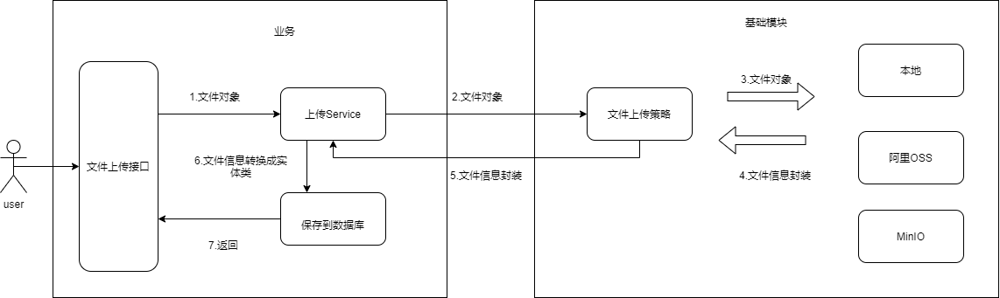

# 文件管理

前排声明：
zeta-kotlin项目的文件管理设计参考自[lamp-boot](https://github.com/zuihou/lamp-boot) 项目的lamp-file模块，在lamp-file的设计上进行了修改。


## 文件上传流程


1. 用户通过`/api/system/file/upload`接口上传文件
2. SysFileService通过调用文件上传策略，将文件上传到配置文件中配置的OSS中去
3. 文件策略会返回一个封装过的文件信息对象`FileInfo`, 从这个对象中可以拿到文件表中必填的一些值
4. SysFileService将文件信息对象`FileInfo`的值处理后得到`SysFile`文件表实体类
5. 保存文件表实体，返回告知前端文件是否上传成功


以上流程涉及到的类有：
```
/** 业务包 */
// 系统文件前端控制器
com.zeta.system.controller.SysFileController
// 系统文件服务实现
com.zeta.system.service.impl.SysFileServiceImpl

/** zetaframework包 */
// 使用策略的客户端
org.zetaframework.extra.file.strategy.FileContext
// 上传文件的信息
org.zetaframework.extra.file.model.FileInfo
```
