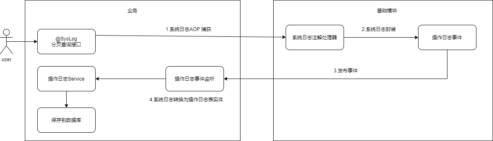

# 系统日志

系统日志目前有两种：一种是用户操作日志（用户接口调用日志、接口调用报错日志），另一种是用户登录、注销日志

操作日志可以通过配置`zeta.log.enabled=false`来关闭日志记录

登录、注销日志，你可以在登录或者注销的时候选择是否发送对应的事件，不发送则不记录


## 操作日志记录、保存流程


1. 用户访问一个被@SysLog注解的接口
2. 被系统日志aop捕获，在进入Controller前记录操作开始时间，执行完Controller之后记录操作结束时间
3. 构造一个系统日志对象，包含操作耗时、类路径、请求的地址等
4. 系统日志aop发布一个操作日志事件
5. 这个事件被`com.zeta.common.config.LogEventConfiguration`里面注册的事件监听器监听到
6. 监听器将系统日志对象传给SysOptLogService的save方法
7. 系统日志转换为操作日志实体类对象，保存到数据库中


以上流程涉及到的类有：
```
/** 业务包 */
// 系统日志监听配置
com.zeta.common.config.LogEventConfiguration
// 操作日志服务实现
com.zeta.system.service.impl.SysOptLogServiceImpl

/** zetaframework包 */
// 系统日志注解
org.zetaframework.core.log.annotation.SysLog
// 系统日志aop
org.zetaframework.core.log.aspect.SysLogAspect
// 系统日志事件
org.zetaframework.core.log.event.SysLogEvent
// 系统日志事件监听器
org.zetaframework.core.log.event.SysLogListener
```


## 登录日志保存流程

请看登录方法`com.zeta.system.controller.MainController#login()`

也是发布事件，监听事件，保存日志这样的流程

